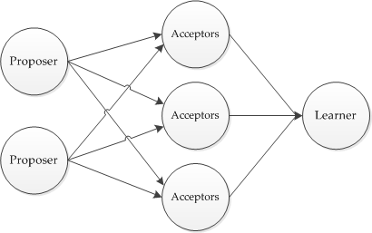
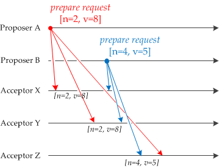
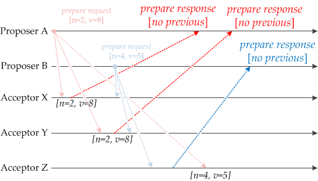
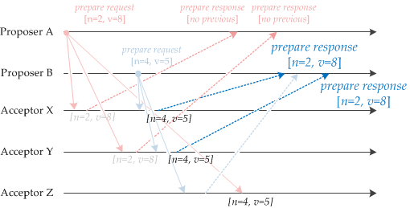

# Paxos By Example（中文翻译）

注：此文，并没有解决提议者收到决策者回应后宕机的问题！所以在翻译的基础上做了扩展，没有用到`learner`角色

注：LogID（实例）和编号不是一个概念，当不同的提议者拿到相同的LogID，才会发送Paxos竞争，而编号肯定是全局唯一的，但只能保证每个提议者的编号**局部递增**，Paxos的主要目的就是保证持久化的LogID**全局唯一和递增**，对于具体的持久化的值不关心，只要保证集群值一致性就行

这篇文章通过一个有效的例子，描述了一个名为`Paxos`的 **分布式**[^1]一致性算法。

分布式一致性算法被用来确保一个集群对一个值做一致性的**操作**[^2]，就如典型的**2pc和3pc**[^3]实现分布式事务的统一提交或回退，保证事务的原子性。`Paxos`协议不关注这个值是什么，只要集群中的多数节点对这个值做了一致性的操作即可。

在分布式系统中（应该说是集群中）做到一致性是很困难的，原因：

1. 信息在集群中传递可能丢失，paxos是基于非拜占庭将军基础上的，不存在信息的篡改和丢失
2. 可能因为网络分区或故障导致很大甚至无限的时延
3. 集群中的节点可能宕机

`Paxos`保证了所有节点只会选择一个值，但是当大多数节点不可用时，不保证有某个值会被选中

**通用方法**

`Paxos`协议中规定了**三个角色**[^4]，任意一个节点可以同时扮演一个或者所有角色。提议者提出一个值，作为一个议案。将这个议案发送给所有的决策者（决定是否接受这个议案）。每个决策者的选择都是独立的，且每个决策者可能收到来自不同提议者的多个议案，并将它的选择发送给学习者（最终确定是否有某个值被选中了）。对于一个通过`Paxos`流程而被选中的值，肯定得到了大多数决策者的选择。下图是，每个节点只承担一个角色的`Paxos`图

 **Paxos例子**，改动比较大了！

在标准的 `Paxos` 算法中 提议者会发送两种信息给决策者：`prepare`、`accept`**请求**[^5]。

**`prepare`阶段：这个阶段都没有v，图片上要忽略v**

1. 提议者发送一个 `prepare`请求（**只包含提议编号n，不包含值**）给所有决策者，提议编号必须是递增且唯一的自然数。
2. 下图，有两个提议者，同时发生了`prepare`请求，A先到达 X和Y，B先到达Z

3. 如果决策者在接收这个`prepare`请求之前，没有接收过别的请求，那么决策者做一个`prepare`响应，承诺绝不接受另一个编号小于n的提议。如下图。

4. 如果决策者已经持久化了一个提议者的议案，则返回NO，告诉提议者重新选择实例。如果之前接收的请求编号小于当前的或者之前没有接收请求，返回YES，如果之前接收的请求编号大于当前的，返回NOT MAX,告诉提议者，加大编号重新请求。

5. 一旦一个提议者收到了到多数决策者的`prepare`**YES**响应，它就会提出`accept`请求。如A收到了X,Y的响应，则提出`accept`请求，**并携带值[2,8]**给所有的决策者。然而，所有决策者将忽略该请求，因为之前已经承诺不接收编号小于4的请求。
6. 如果收到了任意一个NO响应，则重新选择实例
7. 否则加大编号重新请求
8. B同样也收到了大多数的回应，也提出`accept`请求

**`accept`阶段：要带上`value	`了**

1. 提议者发送`accept`请求给所有决策者，**带有值**，如果决策者已持久化某个值，则发送NO给提议者，如果决策者接收了更大的提议编号，则发送NOT MAX，否则，直接持久化当前提议者所带的值，返回YES
2. 提议者收到了大多数的YES，则表示持久化成功，回应客户端YES
3. 提议者收到了任意一个NO，重新选择实例
4. 否则加大编号，重新请求，但是value还是一样的噢，因为最后一致性的是value而不是值

**当很长时间没有接收到大多数决策者的回复时，说明有2N+1个节点不可用**

 **关键：讨论提议者宕机的情况**

1、**发送`prepare`请求后宕机**

1. 提议者在发送`prepare`请求后宕机，即使得到了大多数回应，也无法再发送`accept`请求。但是没关系，如果有并发竞争者，竞争者会用更大的提议编号发给决策者，决策者自然会重新接受更大编号的提议。竞争者会成功持久化。等到宕机恢复后，提议者重新paxos，因为该实例已经最终持久化了，所以会被拒绝，提议者会重新获取新的实例（LogID）再次进行提交。
2. 如果所有的竞争者都宕机了，也没关系，因为实例并没有持久化到任意决策者中，所以之后其它线程会重用此实例（LogID）进行Paxos。当宕机恢复后，再进行此实例的Paxos，会被拒绝

**综上：**因为在`prepare`阶段，其它提议者可以覆盖编号小的提议者，所有防止了提议者在此阶段宕机后，竞争中需要重新获取实例（关键重新获取的实例仍然是当前的LogID，进入了死循环，当然如果两次实例相等则自动+1，来避免，但是产生了一次网络延时），**不会产生一致性问题**

2、**在发送所有`accept`请求后宕机**

1. 提议者在发送`accept`请求后宕机，如果得到了大多数的ACK回应，则说明成功持久化当前实例，宕机无影响，返回客户端UNKOWN状态，恢复之后，在进行一次paxos即可得到答案。如果被拒绝，也没关系。
2. 当获得大多数ACK回应的提议者宕机后，因为其它提议者肯定会收到至少一个决策者的NO回应，告诉提议者实例已经持久化，提议者就会重新申请实例
3. 当收到的回应有NO时，肯定也没关系，当节点恢复，重新跑一遍Paxos自然会被拒绝
4. 所有的都宕机了，如果决策者一个都没有持久化，没关系，**实例会被之后的提议者复用**，只要有一个持久化了，也没关系，实例肯定不会被之后的提议者复用了，且恢复后再跑一遍即可

**综上：**这种情况，**不会影响一致性**

3、**在发送一部分`accept`请求后宕机**

1. 如果这些并发的`accept`请求中，宕机的编号不是最大的，自然会被拒绝
2. 如果是编号最大的，但是只发了部分请求，也没关系，其它`accept`阶段的提议者肯定会被拒绝，只有少数决策者可能会持久化编号小的提议（因为编号大的已经获取了大多数了），拒绝后申请其它实例。其它`prepare`阶段的提议者，肯定会收到某个决策者带有`value`的回复，所以会重新申请实例（或者返回的`accept`带着这个`value`，但是没必要浪费时间）
3. 这种情况可能会造成某个实例（LogID）没有形成一个多数派（宕机回复后，数据丢失自然不能重新对这个实例跑一遍Paxos），**所以可能会有无效的实例**

[^1]: decentralized ：权力下放，去中心化，这里完全可以翻译成分布式
[^2]: 这个操作可以是赋值，关键还可以是一个提交和回退的命令，这样就能将2pc/3pc与paxos联系在一起了，但是还是有本质的区别！如果将2pc/3pc的参与者当作follower，协调者当作leader，只有follower全部回复leader才可以做出命令，不符合paxos的多数派思想。我们可以将协调者，做一个集群，通过paxos协议避免单点问题
[^3]: 2pc和3pc是保证分布式事务的原子性（也可以说强一致性）协议，而paxos是保证集群最终一致性的协议，一个是分布式，一个是集群；一个是原子性，一个是最终一致性。真的完全不同的思想
[^4]: proposer（提议者）, acceptor（决策者）, learner（学习者），可能还有其它角色，但是最关键的只有 proposer，acceptor，其它的不是重点
[^5]: *prepare* and *accept* requests ：很多文章直接把者翻译成（ prepare）和（accept requests）导致很困惑和拗口

原文：https://angus.nyc/2012/paxos-by-example/