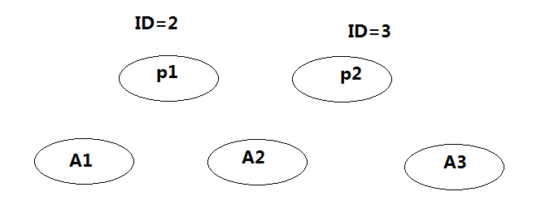

### Paxos关键地方

1. 只有当一个提议者得到了所有接受者的肯定回复后（说明该提议成功得到了一个全局唯一且递增的LogID并且成功持久化），才通知客户端请求成功。
2. 只要一发现自己的LogID可能别的例程已经成功持久化了，则重新获取新的LogID。这样可能有些LogID是无效的。但是没关系主要保证有效的LogID唯一且递增就可以。
3. 2的可能情况
   1. 在第二阶段，Proposer接收到的大多数accept回应中有内容不为空的，则可能其它例程成功，重新获取
   2. 在第二阶段,acceptor接收到Proposer请求时，如果当前acceptor接收的ID大于当前的，说明已经被覆盖了，通知proposer重新获取LogID。如果没有持久化当前的value

如图，p1先得到了A1,A2的回应，后，p2得到A3回应，又因为ID大，所以把A2覆盖了。

这时，p1请求A2时，会被告知重新获取LOGid。但是A1已经持久化了ID2的。

这时，p2请求A1时，会被告知重新获取LOGid，则整个过程此LOGID变成无效的LOGID。

第二种方法是，不是通知proposer重新获取LOGid，而是重新获取ID，直到有大多数持久化时，才重新获取LOGID。

