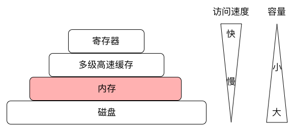
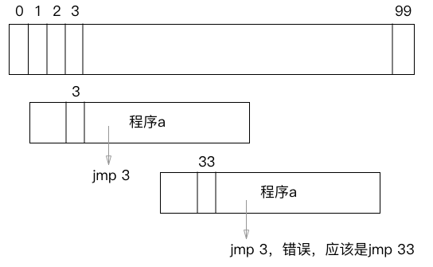
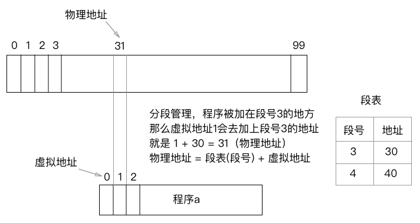
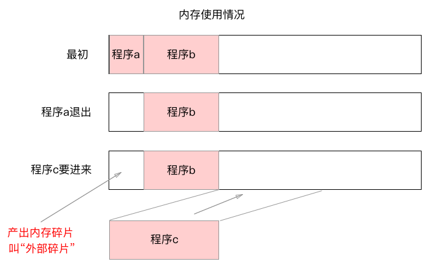
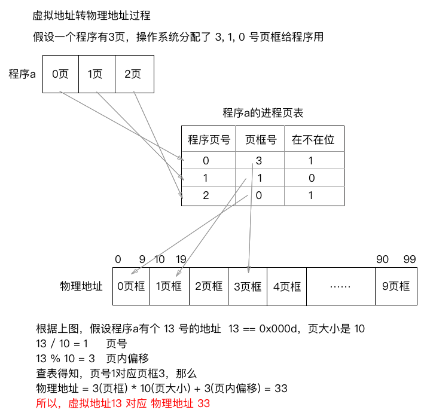

# 通俗讲解计算机内存及页面置换算法

## 1 计算机存储体系

## 2 内存是什么

* 内存是可以记录二进制数据的一种器件，它是连续的结构，可以随机读写，断电会丢失数据，所以程序必须从磁盘加载到内存中才能运行

## 3 内存的管理策略

* 内存是一个**连续的线性结构**，一个4G的内存有很多个元件，把他们**线性排在一起**，就有34359738367个可以存bit的空位 ，计算机一般把8个bit合成一个byte存放，那么就有4294967295个byte，写成16进制就是0x0 ~ 0xFFFFFFFF个地址，每个地址可以取出一个字节的数据

## 4 虚拟内存地址与实际物理地址

1. **直接使用物理地址的情况**

假设程序a第一次启动被装载在1的位置，第二次启动装载在31的位置，而程序a中有段代码 jmp 3 。这会导致 **每次装载位置不同，代码运行的地址就不同，肯定会出错**！

2. 使用虚拟地址

   

* 在使用虚拟地址后，每个程序就认为自己是从0地址开始的，不管加载到哪个地方，都不用修改代码，**通过一个段表就可以把虚拟地址转为实际的物理地址**。 

## 5 段式管理

最开始人们用段式管理，但是段式管理会产生内存碎片，过程如下图 

* 当程序c要加载进内存的时候，因为程序前面的空间不够了，只能从b后面分配，如果这个内存一直没分配，就成了**内存碎片**
* 操作系统为了避免这种情况，充分利用内存空间，当内存不够时，会采取 **内存紧缩**，就是把所有程序都玩左边移动，但是需要很长的时间
* 真实的分配策略是**适配法**，每个进入内存的程序都将适配成最佳的位置，尽量避免内存碎片

## 6 页式管理

* 为了克服段式管理的缺点（外部碎片，内存紧缩），后来就有了页式管理，就是把一定大小的物理空间分成一个一个的页空间，**如4GB的内存，按照4KB为一页，可分成1048576 页**

* 然而一个程序使用了一个页，即使没使用完，其它程序页不能使用了，产生了**内部碎片**

* 虚拟地址到物理地址转换过程 

  

* 上图有个**在不在位**，表示如果程序的页在页框中，那么直接转换，如果不在页框中，会引发**缺页中断**， **操作系统去磁盘上把缺失的页加载进内存**，才进行运行！即**运行中的程序不一定全部在内存中，也可能在磁盘上**，在磁盘上的那部分叫做**虚拟内存**

## 7 页面置换算法

一个程序的部分页面在内存中，部分页面在磁盘上，究竟怎么确定这些页面？ 

* 先进先出（FIFO） 

  最先进来的，就最先淘汰出去。缺点：有些频繁访问的页面也可能淘汰出去 

* 二次机会（SC） 

  最先进来的页面不一定最先出去，如果这个页面的访问标志是1，那么把它置为0，再给它一次机会，如果页面访问标志0，那么才置换出去 

* 最近未使用（NRU） 

  每个页面有两个标志位，标记是否访问，是否修改，显然那么没有怎么访问，没有修改的页面会被淘汰出去 

* 最近最少使用（LRU） 

  这个也很好理解，每个页面有个计数器，访问一次就加1，显然把访问次数很少的那些优先淘汰 

## 8 段页式管理

先将用户程序分为若干段，再把每个段分成若干个页

转自：

https://www.jianshu.com/p/486f48d552e6