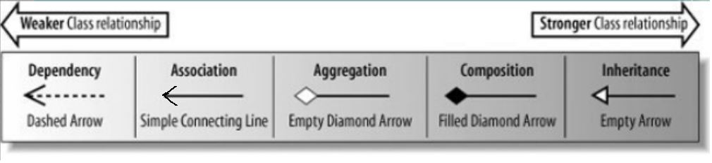
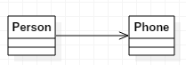
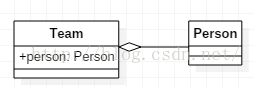
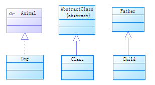

[TOC]

# 前言

## 程序设计是对复杂性的管理

* 待解决问题的复杂性
* 用来解决该问题的工具的复杂性

##  Java的设计目标

* 为程序员减少复杂性，即减少开发健壮代码所需的时间以及困难
* 所以使得代码的运行并不快


# 1 对象导论

## 1.1 抽象的重要性

* 人们所能够解决的问题的复杂性直接取决于抽象的类型[^1]和质量

* 创建抽象数据类型是面向对象程序设计的基本概念之一

*  对象具有：状态[^2]、行为[^3]、标识[^4]

*  类描述了：具有相同**特性**（数据元素）**和行为**（功能）的对象（即实例）集合

## 1.2 面向对象程序设计的概念

* 面向对象程序设计的挑战之一：在问题空间的元素和解空间的对象之间创建一对一的映射
* 代码与隐藏的数据一起构成了**实现**

## 1.3 将对象看成服务提供者（生产者）

* 程序本身向用户提供服务，它将**调用其它对象提供的服务**来实现这一目的
* 有助于提高对象的内聚性：高内聚是软件设计的基本质量要求之一，不能将过多的功能塞到一个对象中

## 1.4 访问权限修饰符

* 让客户端程序员无法接触到他们不需要或不应该接触到的部分——这部分对数据类型的内部操作来说是必须的，但并不是用户解决问题所需要的接口
* 运行库设计者可以**改变类内部的工作方式而不用担心会影响其它类**，可以使接口和实现清晰的分离

1. public：在任何类里，**创建该对象后**，都可以直接调用public修饰的属性和方法
   * **能被继承**
2. protected：在同一个包内，创建该对象后，可以调用。且可以继承使用
   * **能被继承**
3. 默认：在同一个包内（**即处于同一级别**），包的父包就不行了，**不能被子类继承**
   * **不能被继承**
4. private：只有在该类里，**创建该对象后**，才可以调用private修饰的属性和方法
   * **不能被继承**

public -> protected -> 默认 -> private

## 1.5 URL类型分析



关系强弱顺序：依赖 < 关联 < 聚合 < 组合 < 继承

**依赖：**弱相关，只是**在方法中用到**


```java
public class Person {
	public void doSomething(){
		Card card = new Card();//局部变量
		....
	}
}
public class Person {
	public void doSomething(Card card){//方法参数
		....
	}
}
public class Person {
    Card card;
	public void doSomething(Card card){
		int id = Card.getId();//静态方法调用
		....
	}
}
```

**关联：**比实现相关性强，是类的属性

**单向或双向**（通常我们需要避免使用双向关联关系），是一种"has a"关系，如果A单向关联B，则可以说A has a B，通常表现为全局变量 



```java
public class Person {
	public Phone phone;
	
	public void setPhone(Phone phone){		
		this.phone = phone;
	}
	
	public Phone getPhone(){		
		return phone;
	}
}
```

**聚合： **关联关系的一种， **整体不存在了，部分依然存在** 

单向， **关联关系的一种**，与关联关系之间的区别是语义上的，关联的两个对象通常是平等的，**聚合则一般不平等**，有一种**整体和局部**的感觉 



```java
public class Team {
	public Person person;
	
	public Team(Person person){
		this.person = person;
	}
}
```


**组合：**单向，强依赖的特殊聚合关系 ， **整体不存在了，部分也将消亡** 


```java
public class Person {
	public Head head;
	public Body body;
	public Arm arm;
	public Leg leg;
	
	public Person(){
		head = new Head();
		body = new Body();
		arm = new Arm();
		leg = new Leg();
	}
}
```

**实现：**接口

**继承：**即"is a"关系，类继承抽象类 



## 1.6 类的层次结构

* UML类型，构成了类的层次结构

## 1.7 多态

* 把对象**不当作**它所属的特定类型来对待，而是将其**当作基类的对象来对待**
* 即方法操作的是泛化类型，不需担心对象将如何处理消息
* 前期绑定：方法运行时将这个调用**解析到将要被执行的代码的绝对地址**
* 后期绑定：Java使用一小段特殊的代码来**替代绝对地址调用**
* C++默认的是前期绑定，只有使用`virtual`关键字修饰才会为后期绑定，Java 默认是后期绑定


参考：

https://blog.csdn.net/a19881029/article/details/8957441


[^1]: 类型是指：所抽象的是什么，汇编语言是对底层机器的轻微抽象，其它命令式语言（FORTRAN,BASIC,C）是对汇编的抽象
[^2]: 内部数据
[^3]: 方法
[^4]: 每个对象都是唯一的，是具有相同的特性和行为的对象所属的类的一部分