# 海量数据和高并发的解决方案

## 1 海量数据的解决方案

1. 使用缓存
2. 使用静态化技术
3. 数据库优化
4. 分离数据库中活跃的数据
5. 批量读取和延迟修改
6. 读写分离
7. 使用NoSQL和Hadoop等技术
8. 分布式部署数据库
9. 应用服务和数据库服务分离
10. 使用搜索引擎搜索数据库中的数据
11. 进行业务拆分

## 2 高并发的解决方案

1. 页面缓存
2. 集群和分布式
3. 反向代理
4. CDN

## 3 缓存

通过一致性hash将数据分布到不同的缓存服务器中，缓存查询的时候可以直接定位特定的缓存服务器

## 4 页面静态化技术

1. 传统的JSP界面，前端的显示是通过后台服务器进行渲染后返回给前端进行解析执行的。而现在提倡前后端分离，后端只提供数据，通过前端浏览器进行数据的渲染，减轻后端服务器的压力
2. 可以将静态资源（HTML/CSS/JS/图片等）放置在缓存服务器上或者CDN[^1]服务器上，一般使用最多的是CDN服务器或nginx服务器提供静态资源功能

* 尽量减少HTTP请求

* 使用CDN

* 使用Gzip压缩请求

* 缓存

  

## 5 正向代理与反向代理

代理服务器：一般指局域网内部的机器通过**代理服务器**发送请求到互联网上的服务器，代理服务器一般作用在客户端

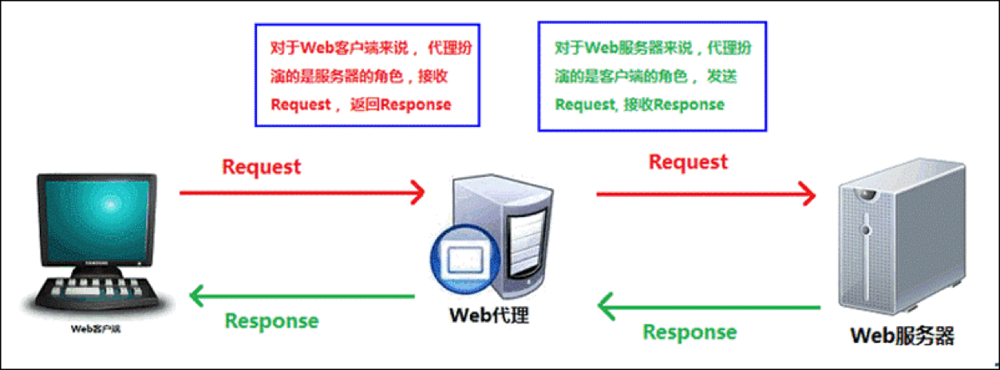

**正向代理服务器**：作用于客户端，在客户端将我们的HTTP请求转发到其它不同的服务器端，实现请求的分发

**反向代理服务器**：作用于服务器端，它在服务器端接收客户端的请求，然后将请求分发给具体的服务器进行处理，然后再将服务器的相应结果反馈给客户端。Nginx就是一个反向代理服务器软件

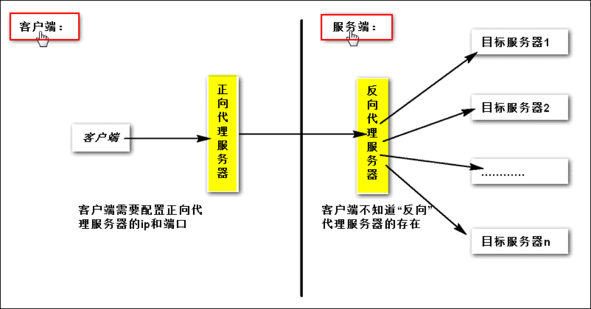

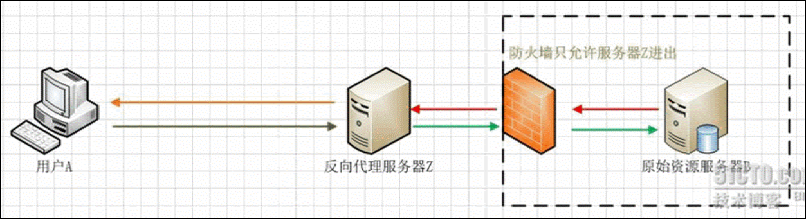

* 通过反向代理实现：权限认证，拦截，日志，负载均衡

## 6 架构

 **架构的定义**：架构就是一个架子，放一些业务和算法；架构就是对我们重复性业务的抽象和我们未来业务扩展的前瞻

 **架构师能力**：

1. **抽象的能力**：最基本的就是去重，去重在整个架构中体现在方方面面，从定义一个函数，到定义一个类，到提供一个服务，以及模板，背后都是要去重提高可复用率
2. **分类能力**：做软件需要做对象的解耦，要定义对象的属性和方法，做分布式系统的时候要做服务的拆分和模块化，要定义服务的接口和规范
3. **算法（性能）**：它的价值体现在提升系统的性能，所有性能的提升，最终都会落到CPU,内存,IO和网络这4大块上

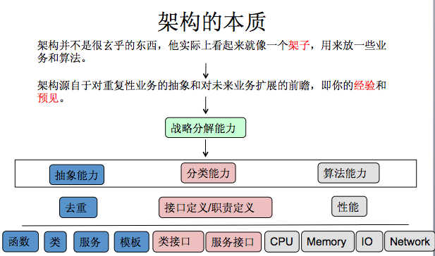

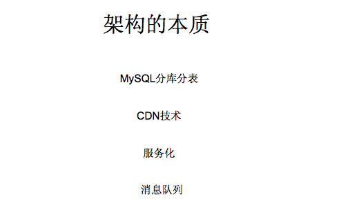

* 在分布式系统中我们会做MySQL分库分表，要从不同的库和表中读取数据，这样SQL就可以使用模板，因为绝大多数SQL语义使相同的，除了路由到哪个库哪个表
* CDN：做网络智能调度优化和多级缓存
* 服务化：做抽象和做服务的拆分
* 消息队列：本质上还是分类，将两个子系统通过队列解构并异步化

**微博的架构**

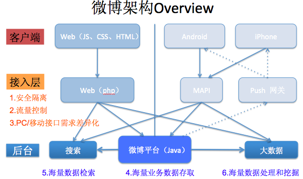

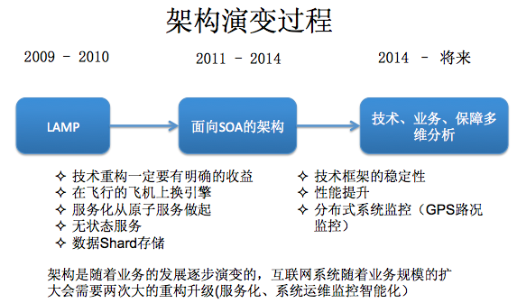

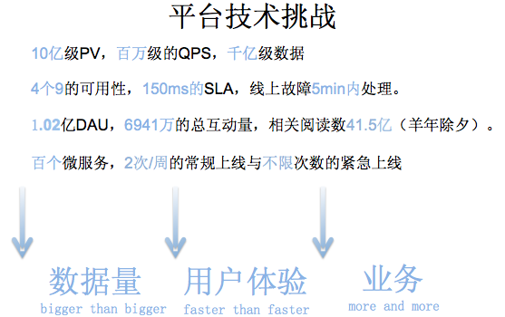

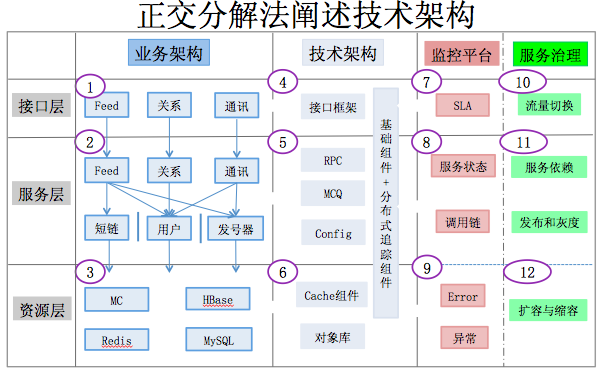

* 水平拆分：接口层，服务层，数据存储层
  1. 接口层：做参数的解析，参数的验证，序列化和反序列化 
  2. 服务层：业务逻辑的处理
  3. 数据存储层：做缓存/DB相关的各类组件
* 垂直拆分：业务架构，技术架构，监控平台，服务治理

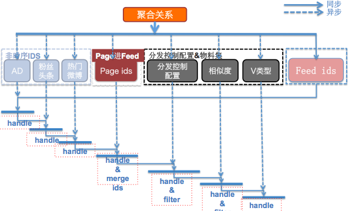

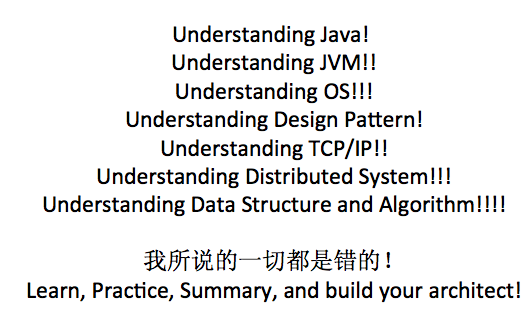

## 7 分布式事务中2PC与3PC的区别

在分布式系统中，每个节点知道自己执行的事务是否成功，但是无法知道其它节点的事务执行情况。为了保证事务的ACID，需要一个协调者，来告知其它节点的事务执行情况

### **二段提交协议2PC**

主要分为两个阶段：准备阶段和提交阶段。

**准备阶段**：各个节点执行事务，并向协调者发送事务执行状态

当协调者收到所有参与者的反馈后，开始事务提交阶段。

**提交阶段**：如果所有参与者都执行成功，向所有参与者发送commit请求，只要又一个执行识别，发送roolback

优点是：原理简单，实现方便。缺点也很明显：同步阻塞，单点问题，脑裂。 

####  **2PC故障情况分析**

1. **协调者正常，参与者宕机**

- 发生在第二阶段：无论协调者发起的是提交还是终止，那宕机的参与者在重启之后，都将执行对应操作，不存在不一致情况。

- 发生在第一阶段：由于协调者无法收集到所有参与者的反馈，会陷入阻塞情况。

  **解决方法**：引入超时机制

  * 超过指定时间未收到反馈，事务失败，向所有节点发送终止事务请求。
  * 宕机的节点启动后，收到终止事务请求，该事务失败。

  **小结：**由于协调者没挂，无论参与者是否宕机，都可以从协调者这里获取正确的状态 ，保持数据一致性

2. **协调者宕机，参与者正常**

   无论处于哪个阶段，由于协调者宕机，无法发送提交请求，所有处于执行了操作但是未提交状态的参与者 **都会陷入阻塞情况** 

   **解决方法：**引入协调者备份，同时协调者需要记录操作日志

   - 当检测到协调者宕机一段时间后，协调者备份取代协调者，并读取操作日志，向所有参与者询问状态。
   - 如果是在第一阶段，则继续操作，都是YES，则发送commit
   - 如果是在第二阶段，只可能是commit和roolback的其中一个状态，所以向没提交的发送同样的状态，保持数据一致

3. **协调者和参与者都宕机了**（协调者的状态丢失了，向参与者问，但是参与者也丢失了）

   首先通过协调者备份，恢复协调者，**通过日志找到未完成的事务**，对参与者发起询问。由于**参与者存在宕机**，又3种情况

   1. 存在commit或abort（只可能是一种），指执行相应操作
   2. 存在未开始的节点，说明没有节点到第二阶段，可以直接终止，或者继续事务
   3. 为宕机的节点都是prepare状态，则无法判断宕机节点的状态，可能已经接受了协调者的commit/roolback并成功执行，所以很糟糕
      1. 如果宕机节点都是prepare或未开始，没问题
      2. 如果宕机节点是commit/abort，则该节点事务已结束，必须对其它节点执行相应操作，**但是不知道节点什么状态，除非重新启动**

   **小结：**当协调者和参与者都宕机时，并且未宕机的都是**prepare**状态，则无法解决问题，**只能等参与者恢复，并确认参与者状态**

###  **关键！关键！关键！关键 paxos的用处**

**关键！：**只要解决协调者单点问题就行，用paxos协议，做多个协调者，只有超过半数的协调者都接收到了相同的信息，才向参与者返回。**这样协调者的信息肯定不会丢失**

### **三阶段提交协议（3pc）**

3pc把2pc的准备阶段再次一分为二，这样就又了 `CanCommit`、`PreCommit`、`DoCommit`三个阶段。

1. 在第一阶段，只询问所有参与者是否可以执行事务操作，并不在本阶段执行事务，参与者返回YES、NO 
2. 第二阶段，当协调者收到所有的参与者都返回YES时，则通知参与者，执行事务操作；如果第一阶段 **存在NO或超时则ABORT**
3. 第三阶段，协调者如果第二阶段存在NO或者超时则ABORT，如果全部是ACK则COMMIT

#### **2PC与3PC异同**

1. 2pc在第一阶段就执行对应操作（资源被锁定），而第二阶段是提交
2. 3pc在第一阶段只是询问能否提交，并不锁定资源；第二阶段再锁定资源执行对应操作；第三阶段是提交
3. 3pc如果 **第二阶段执行后**，超过一定时间未收到**协调者信息**，会**自动提交**

#### 3PC故障情况分析

只考虑协调者和参与者都宕机的情况，其它情况和2pc一样

1. 存在commit或abort，执行相应操作
2. 如果有节点是CanCommit，说明**事务肯定没提交**，直接终止
3. 未宕机的都是**PreCommit**状态。
   1. 如果宕机参与者是**PreCommit**状态，重启后会收到COMMIT消息，没问题
   2. 如果是commit状态，也没问题
   3. 如果是abort状态，**由于其它节点变成了commit**（第二阶段后，参与者未接收协调者消息会自动提交），出现状态不一致
   4. 如果宕机节点是`CanCommit`状态，还未收到协调者的PREPARE消息，这时它只可能是返回YES，重启后收到PREPARE和COMMIT后，状态也正确

### 总结

1、3pc再参与者完成了第二阶段的事务后，使用了自动提交的方式解决了2pc中参与者无法判断状态需要不断等待的情况，提高了服务的可用性。

2、但是比2pc多了一个**询问**步骤，增加了延时。

3、同时3pc可能存在网络问题，当协调者准备发送abort时，网络出问题了，参与者会自动提交，导致数据不一致

4、3pc并没有解决2pc参与者和协调者同时宕机时的问题，只是做了自动提交，提升了服务的可用性

5、而2pc不能做自动提交！因为2pc如果自动提交，错误性会更大，因为当前节点都不知道其它节点能不能提交呢（3pc在询问阶段做了保证）

6、综上，2pc延迟低，但是参与者故障后可能会阻塞；3pc可用性高，但可能因为网络问题导致数据不一致，且延迟高一点点

## 8 paxos、zab、raft

### paxos

* 是一种分布式系统对某一值达成一致的算法，主要思想是2pc和选举机制（少数服从多数）。
* 主要争对的是**多个节点对某一值(logID)提出多个提议（内容）！！**的时候，如果让所有节点统一接受一个节点的提议

例子：

假设有A,B,C,D五台机器。KV系统要Put一个数据[key=whis->val=3305]到这5台机器上。

1. 首先，客户端随机选择一个节点，进行写入提交，这里随机选择了C节点，这时C就是这次提议的发起人，当C收到这个提议的时候，C首先要做的事情是根据当前节点的最新全局globalId，做一次自增操作，假设当时的globalId是0，所以，这个议案就被对应了一个编号，1-->[key=whis->val=3305]
2. globalID是确认事务的发生顺序用的，显然，**只有当两个事务同时发生时，两个事务才会取得同一个globalId**，这是才会发生，**提议竞争的情况**，通过paxos协议保证所有节点选择同一个事务的globalID对应的内容即可，另一个事务，重新获取globalID，这样就保证了globalID的连续性和事务的连续性
3. 如果发生竞争，比如D也拿到了globalId=1，这样不同的事务拿到的全局id一样
   1. 这五个节点就要执行paxos流程，来选取其中的一个事务当作全局变量为1的事务
   2. 首先，C/D生产一个提议ID，将提议ID发送给其它节点，其它节点判断有没有预接受的提议，如果没有或是预接受的提议ID小于此ID，**就预接受此ID**，将预接受信息发送给此ID的提议者。如果已有接受了的提议ID，则将，已接受ID的**内容**，一同发送给此提议者

### zab

* 重点在于启动时就选主，然后提供正常服务，也就是说只有一个提议者，n-1个学习者。**这个思想正好能满足2pc和3pc的协调者的单点问题！！！**

### raft

* 和zab的区别在于选举的方式，zab时广播式互相计数的方式，发现别人比自己牛逼时，要帮助别人扩散消息，根据本机计数决定谁是主。
* raft是

参考：

https://www.cnblogs.com/shanyou/p/5048099.html?utm_source=tuicool&utm_medium=referral

https://baijiahao.baidu.com/s?id=1609465825718473855&wfr=spider&for=pc

https://blog.csdn.net/Lnho2015/article/details/78685503

[^1]: 是一个内容分发网络，通过缓存和负载均衡技术使用户获取最近的数据节点中的内容
